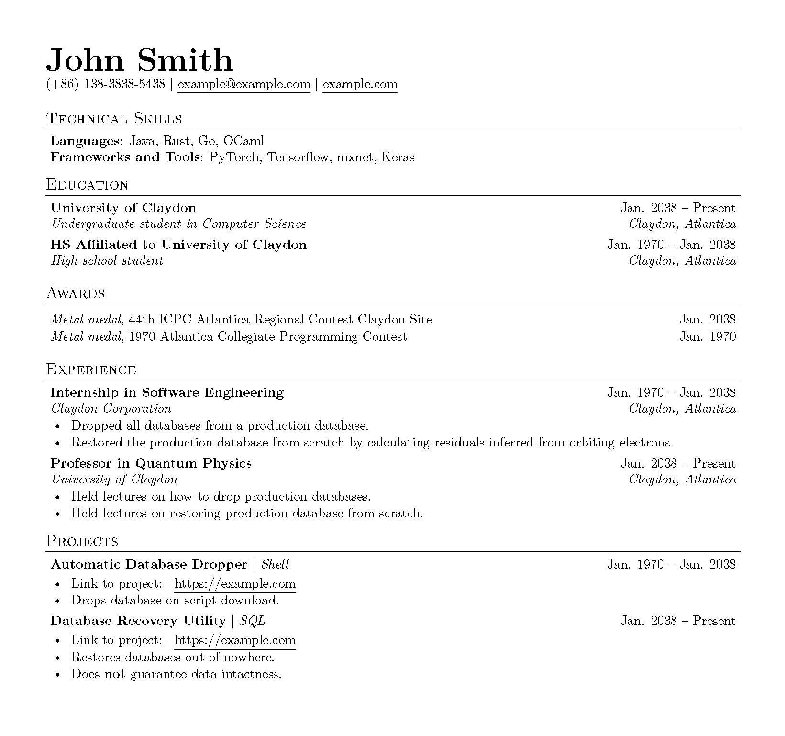

# migurdia

Semantic-based $\LaTeX$ resume template.

Migurdia aims at creating a resume template whose body is entirely free of formatting and styling except those specifically specified by the user. All sections and data groups are customized through key-value arguments and can be used or interpreted with ease.

