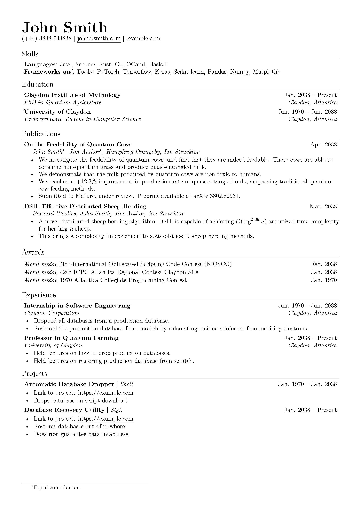
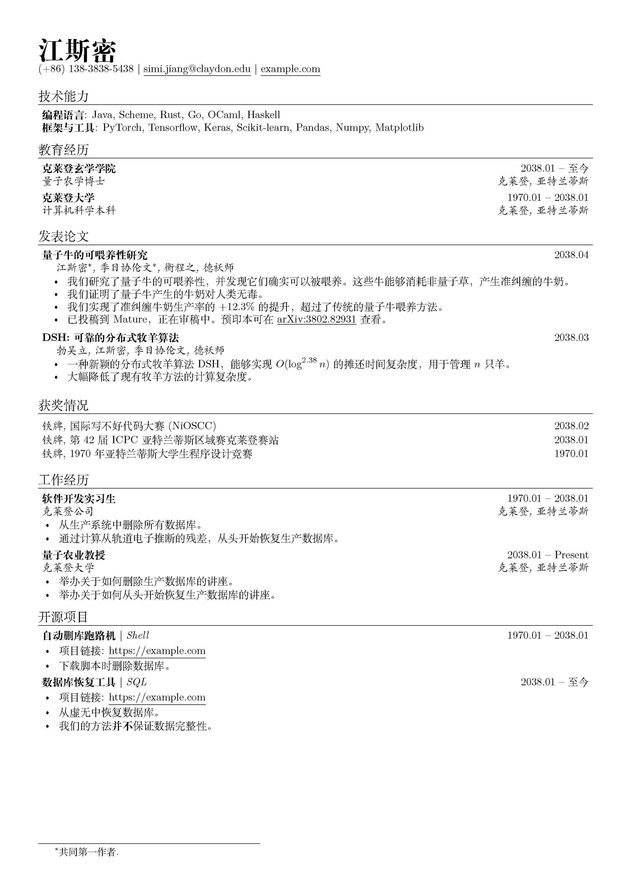

# migurdia

Semantic-based LaTeX resume template.

Migurdia aims at creating a resume template whose body is entirely free of formatting and styling except those specifically specified by the user. All sections and data groups are customized through key-value arguments and can be used or interpreted with ease.



We also support other languages with a single flip of a conditional switch.

```latex
\renewcommand{\configureResumeLanguage}{zh-Hans}
```



## Usage

XeLaTeX is required for using migurdia.

You may start typesetting your resume right away by just editing `template.tex` aside `migurdia.tex` in the same directory. Documentation can be found in `migurdia.tex` above command definitions.

If you are using Overleaf, do remember to:

* set your *compiler* in the *menu* to *XeLaTeX*
* ensure that the *main document* is *not* `migurdia.tex`

If you wish to enable CJK character support, you would have to uncomment certain sections in `migurdia.tex` in order to have them shown naturally.
